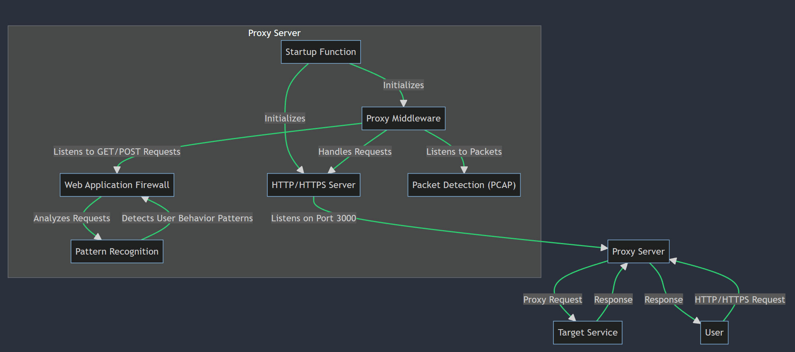

# Micro Packet Guardian

The Micro SIEM (Security Information and Event Management) is a robust system designed to monitor network traffic, capture packets, and apply advanced security analysis techniques. This project is tailored to provide real-time visibility into network activities, extract relevant information from packets, and generate valuable insights for network security analysis.

From building a WAF, live monitoring with elements of SIEM which is seperated into 3 sections:

- **Section 1**: Show case upon a client loading the page it updates the paths it took and will eventually count how many times those sections of the website has loaded to give visual representation of what's happening on the website in realtime. Great to instantly visualize DDOS of constantly loading pages or simply want to see how the website is loading what sections.

Done - Showing realtime events from back through to frontend via chart/diagram.
Show case of this feature - https://www.youtube.com/watch?v=bkx7RX__k6E

Dev - Capturing IP and highlighting country, type of device and so on
Dev - Saving data in the cache to database to scrub through timeline

- **Section 2**: Is to identifying get/post requests and show the input requests from the user to see if users are tempering with the website like input manipulation (xss, sql injection and others).

- **Section 3**: Last using pcap capturing packets to grab incoming and outgoing traffic eventually with pattern recognition and/or detection of malicious content. At least capture the event via .pcap file correlating with section 1 and 2.

## Features (Indevelopment)

- **Packet Capture**: The system utilizes Packet Capture (PCAP) to intercept and log network traffic. This real-time visibility into network activities allows for immediate detection and response to potential threats.

- **Security Analysis**: Advanced security analysis techniques are applied to the captured packets. This enables the identification of potential threats, anomalies, and suspicious behavior patterns, enhancing the overall network security.

- **Granular Monitoring**: The system leverages micro sensor technology to perform fine-grained analysis at the packet level. This enhances security monitoring capabilities by providing detailed insights into each packet that traverses the network.

- **Event Correlation**: The system processes, correlates, and organizes the captured information to generate meaningful security insights and alerts. This allows for a comprehensive understanding of network activities and potential security threats.

- **Web Application Firewall (WAF)**: The system includes a WAF that listens to GET/POST requests, analyzes them, and detects user behavior patterns. This feature adds an additional layer of security by protecting the network from common web-based threats.



The above diagram illustrates the flow of the system. User requests are intercepted by the Proxy Server, which then forwards the requests to the Target Service. The Proxy Server is initialized by the Startup Function and handles requests using the Proxy Middleware and the HTTP/HTTPS Server. The Proxy Middleware listens to GET/POST requests and packets using PCAP, and sends them to the Web Application Firewall (WAF). The WAF analyzes these requests and sends them to the Pattern Recognition system, which detects user behavior patterns and sends this information back to the WAF.

## Usage

1. Clone the repository:

```shell
git clone https://github.com/planetbridging/MicroPacketGuardian.git
```
